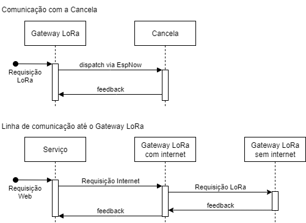

# LoRa Gateway + Mash with ESPNOW

A arquitetura se baseia no seguinte formato:



# Projeto ESP32 + Rust

Este projeto foi desenvolvido utilizando **Rust** para programar microcontroladores **ESP32**, usando a infraestrutura do **ESP-IDF**.

O objetivo deste guia é documentar, de forma detalhada, como configurar o ambiente de desenvolvimento em **Linux** (foco em **Arch Linux**) e **Windows**, além de descrever como compilar, gravar e monitorar o ESP32.

---

## 🚀 Requisitos

Antes de iniciar, garanta que os seguintes componentes estão instalados:

- [Rust](https://www.rust-lang.org/) — versão mais recente (via [rustup](https://rustup.rs/) ou [mise](https://mise.jdx.dev/))
- [`espup`](https://github.com/esp-rs/espup) — instala toolchains para desenvolvimento em ESP32
- [`espflash`](https://github.com/esp-rs/espflash) — ferramenta para gravar e monitorar firmware no ESP32
- [`cargo-generate`](https://github.com/cargo-generate/cargo-generate) — **opcional**, usado apenas na criação inicial do projeto a partir de templates

No Arch Linux, algumas dependências adicionais são necessárias:

```bash
sudo pacman -S base-devel pkg-config libusb libftdi python cmake ninja
```

---

## ⚙️ Configuração do Ambiente

### **1. Instalar o `espup`**

O `espup` instala os toolchains específicos para o ESP32 (Xtensa).

```bash
cargo install espup --locked
```

Depois de instalado, execute:

```bash
espup install
```

Isso irá baixar e configurar as ferramentas necessárias para compilar projetos para ESP32.

---

### **2. Configurar o toolchain `esp`**

O ESP32 não utiliza o Rust padrão, mas sim um toolchain modificado.  
Defina o toolchain global para **esp**:

```bash
export RUSTUP_TOOLCHAIN=esp
rustup default esp
```

> 💡 **Dica**: Se você usa o [mise](https://mise.jdx.dev/), verifique se ele não está sobrescrevendo o `rustup`.  
> Caso esteja, ajuste sua configuração para evitar conflitos. (Aconteceu bastante comig)

---

### **3. Instalar o `cargo-generate` (opcional)**

O `cargo-generate` foi utilizado apenas na **criação inicial do projeto**, para baixar o template oficial de projeto ESP32.

```bash
cargo install cargo-generate
```

Exemplo de uso:

```bash
cargo generate esp-rs/esp-idf-template
```

---

### **4. Corrigir problema de `libxml2` no Arch Linux**

No Arch Linux, a biblioteca `libxml2` tem uma versão diferente do que o `esp-idf` espera.  
Resolva isso criando um link simbólico:

```bash
sudo ln -s /usr/lib/libxml2.so.16 /usr/lib/libxml2.so.2
```

> ⚠️ Este passo é **específico para Arch Linux**.

---

### **5. Configurar acesso à porta serial (Linux)**

No Linux, o usuário precisa ter permissão para acessar portas seriais (`/dev/ttyUSBx`).  
Adicione seu usuário aos grupos `uucp` ou `dialout`:

```bash
sudo usermod -a -G uucp $USER
sudo usermod -a -G dialout $USER
```

Depois, **reinicie a sessão** ou rode `newgrp` para aplicar as mudanças.

---

### **6. Configuração no Windows**

No Windows, os passos são um pouco diferentes:

1. **Instale os drivers do chip USB-UART** (Silicon Labs):  
   [https://www.silabs.com/developers/usb-to-uart-bridge-vcp-drivers](https://www.silabs.com/developers/usb-to-uart-bridge-vcp-drivers)

2. **Instale Rust, espup e espflash:**

   ```powershell
   cargo install espup --locked
   cargo install espflash
   ```

3. **Configure o toolchain ESP:**

   ```powershell
   setx RUSTUP_TOOLCHAIN esp
   rustup default esp
   ```

4. A porta serial no Windows normalmente será algo como `COM7` ou `COM8`.  
   Você pode verificar isso no **Gerenciador de Dispositivos**.

---

## 🛠️ Comandos principais

Um `Makefile` está disponível para simplificar tarefas comuns.

| Comando              | Descrição                             |
| -------------------- | ------------------------------------- |
| `make build`         | Compila para o ESP32                  |
| `make run`           | Build + Run direto no ESP32           |
| `make flash`         | Grava firmware no ESP32               |
| `make monitor`       | Monitor serial                        |
| `make clean`         | Limpa build                           |
| `make setup-linux`   | Configura ambiente no Linux (Arch)    |
| `make setup-windows` | Instruções de configuração no Windows |

---

## 🔧 Executando o projeto

### Compilar e rodar diretamente:

```bash
cargo run --target xtensa-esp32-espidf
```

### Gravar no ESP32:

```bash
make flash PORT=/dev/ttyUSB0
# ou no Windows
make flash PORT=COM7
```

### Somente monitorar a saída serial:

```bash
make monitor PORT=/dev/ttyUSB0
```

---

## Dicas:

### Rodando no WSL

**Adicionar Device**

Rodar esse comando para vericar o BUSID

```bash
usbipd list

====Output====

BUSID  VID:PID    DEVICE                                                        STATE
2-2    10c4:ea60  Silicon Labs CP210x USB to UART Bridge (COM7)                 Shared
```

Depois adicionar o dispositivo no WSL

```bash
usbipd attach --wsl --busid [BUSID]
```

## 🐛 Problemas comuns

### Erro: `libxml2.so.2 not found`

**Solução:**

```bash
sudo ln -s /usr/lib/libxml2.so.16 /usr/lib/libxml2.so.2
```

---

### Erro: `espflash::serial_not_found`

Esse erro indica que o ESP32 não foi encontrado na porta especificada.

Verifique:

1. Se o ESP32 está conectado corretamente.
2. Se você tem permissão na porta serial (`uucp` e `dialout` no Linux).
3. Se a porta correta foi informada:
   - Linux: `/dev/ttyUSB0`, `/dev/ttyS7`...
   - Windows: `COM7`, `COM8`...

## 